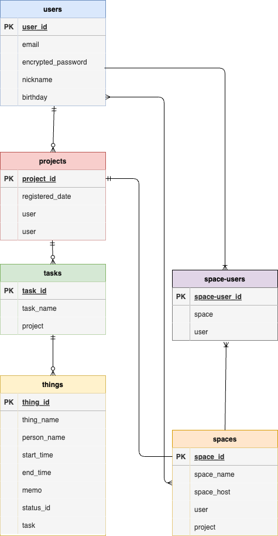

# アプリケーション名

This README would normally document whatever steps are necessary to get the
application up and running.

# アプリケーション概要
日毎の自身のタスク（以降タスク）を大きなタスク（以降大タスク）に紐付け、細かく管理することができるほか、そのタスクを他の利用者とシェアすることで複数人で取り組むタスクも正確に進捗管理ができる。

# URL
http://52.199.186.203/

# Basic認証
・ Basic認証ID：admin 
・ Basic認証パスワード：2222 
・ メールアドレス：test@test.jp 
・ パスワード：aaaa1111

# 利用方法
__スケジュール作成__
-
1. ログイン画面からログイン。 （ユーザーを持っていない場合は、新規作成ボタンを押下し、ユーザーの新規登録を実施。） 
2. 一覧表示画面のカレンダーから、日付を選択しスケジュール作成画面に遷移する。 
3. 以下のように、大タスクとそれに紐づく複数のタスクをそれぞれのアイコンを押下することで増やせるため、必要項目を入力し、登録ボタンを押下。

__スケジュールをシェアする__
-
1. 一覧表示画面のカレンダーから、予定が入っている日付を選択しスケジュール一覧画面に遷移する。
2. 左上「タスクをシェアする」リンクを押下し、メンバー選択画面に遷移する。
3. 登録されているメンバー一覧が表示されるため、タスクを共有したいメンバーを選択し、登録ボタンを押下。 
※ 共有されたタスクは、作成者は自身の**カレンダー画面**から、それ以外の人は**ヘッダー**から確認することができる。

__大タスクに紐づくタスクを編集する （対応状況など）__
-
1. 編集したいタスクの存在する予定一覧画面に遷移する。
2. テーブルでタスクの詳細画面が表示され、一番右のアイコンを押下することで、タスクに対応するモーダル画面が表示される。
3. 編集したい箇所を書き換え、変更ボタンを押下することで、変更が適用できる。

__大タスクに紐づくタスクを追加する__
-
1. 追加したいタスクに対応するスケジュール詳細画面に遷移する。
2. テーブルでタスクの詳細画面が表示され、一番左の大タスクのボタンを押下することで、大タスクに対応する新規追加用モーダル画面が表示される。
3. 追加したい情報を記入し、追加ボタンを押下することで、大タスクに紐づくタスクが追加できる。

# アプリケーションを作成した背景
「複数人で取り組むタスクの期限が週末などに切られている場合、その日のメンバーごとのタスクが見えにくい」という課題を解決するために作成。 課題分析をした結果、「チームに与えられたタスクに対し、メンバー自身がどの部分をどのくらい取り組めばいいか見えにくい」ことが真因であると仮説だて、それを解決するべく、チームタスクに対し取り組むタスクを設定でき、それを複数人で共有できるアプリケーションを作成した。

# 開発環境
・ フロントエンド：Ruby 3.2.0 

# ローカルでの動作方法
以下のコマンドを順に実行。 
% git clone https://github.com/sora-site/tododbd.git 
% cd ~/../tododbd 
% bundle install 
% rails db:create 
% rails db:migrate

# データベース設計

# 工夫したポイント
**フレームワーク(Ruby on Rails)の強みを活用**
-
・Ruby on Railsでは、ユーザー管理などさまざまな機能のパッケージがgemとして提供されており、それらをインストールすることで、低いコストと高い開発スピードで開発を行うことができる。  
・本アプリケーションはそのパッケージをカレンダー部分や、タスクの新規登録を行う際の機能で取り入れており、作成コストを抑えた上でサーバーサイドの機能を実装できている。

**DB設計について**
-
・メンバーごとに細かいタスク管理を行う要件を満たすための正規化を実施し、親→子→孫の三層構造のアソシエーションを定義。  
・また、その他のアソシエーションが複雑になりすぎないように隣接する機能は、テーブルの数を抑えて実装した。

**スケジュール一覧画面・編集用モーダル画面**
-
・スケジュール一覧画面(親テーブルの画面)で、 メンバーごとの情報（孫テーブルの情報）を閲覧できるようにするため、子・孫テーブルを含めた3つのテーブルから関連するデータを取得するためのMVCの記述を行った。

・不要な画面遷移を減らすために、編集機能はモーダル画面を用いて行うように実装。それにより、アプリケーションを用いた編集機能を用いる際の、ユーザー側の負担を抑えるようにしている。